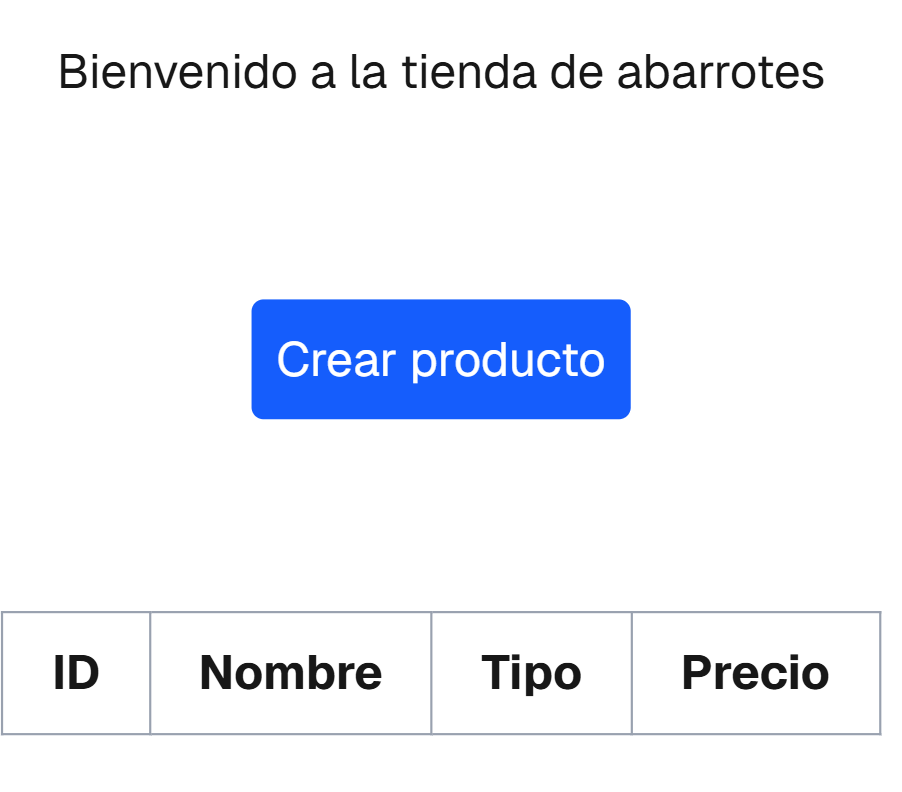
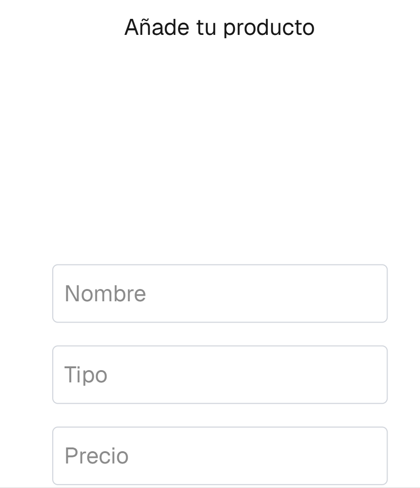
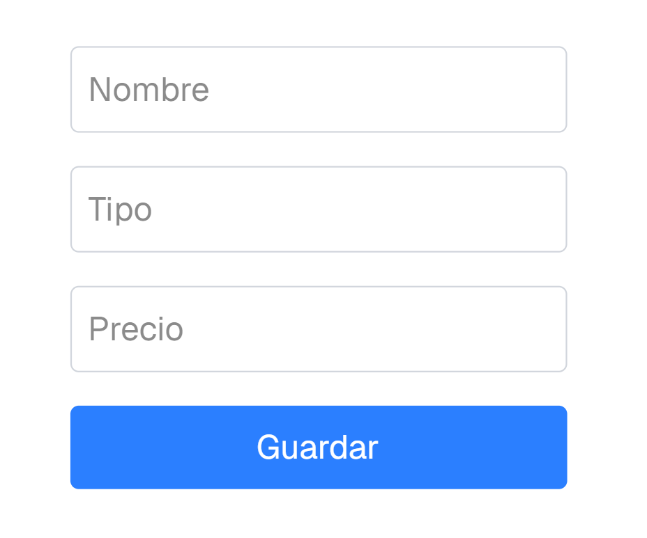
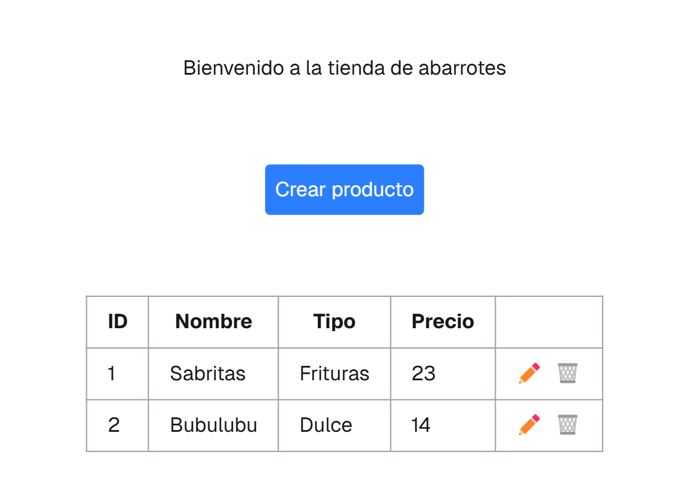
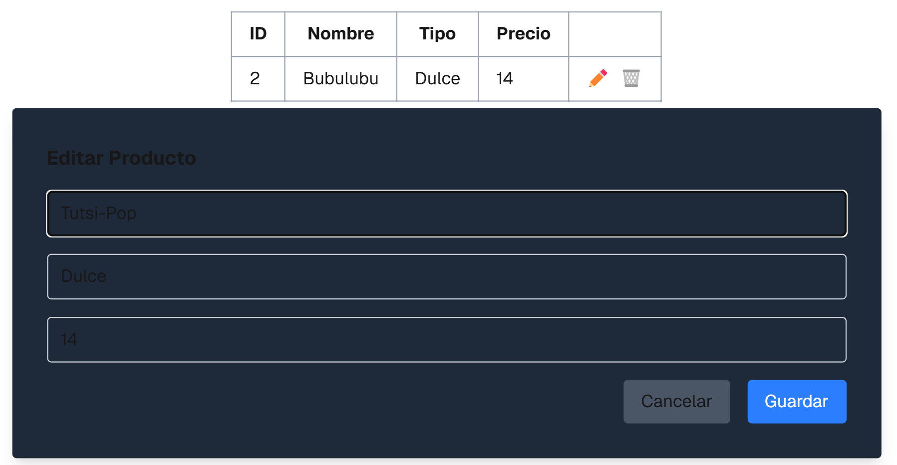
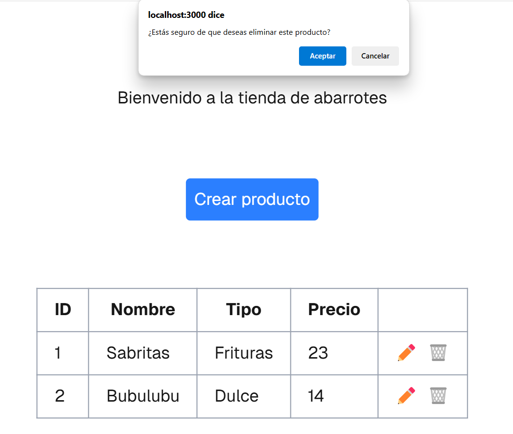
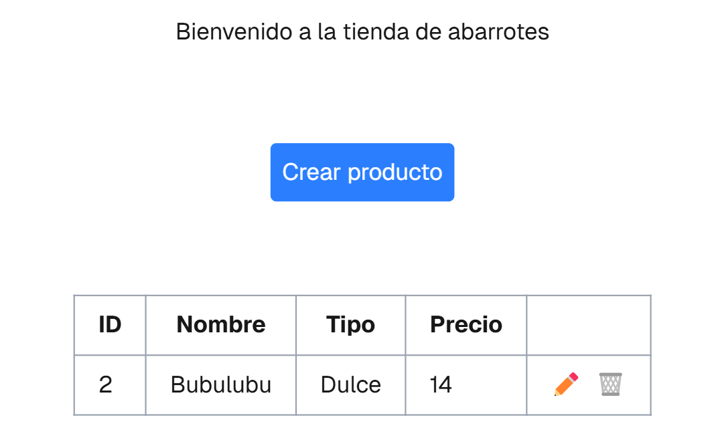

# Proyecto Productos

## Explicación de como funciona el backend y frontend

### Backend

El backend fue creado con ayuda de FastAPI. Almacenamos los archivos en /app/proyectos/dramos, donde encontraremos un modulo 
y 3 archivos donde se concentrará la lógica.

Para correr nuestro backend usamos el comando
uv run fastapi dev

### Frontend

Nuestro frontend se encuentra en la carpeta /frontend/dramos, esta creado por medio del framework NextJS y este se conecta al backend con la ruta http://127.0.0.1:8000/api/v1/dramos/productos/. Iniciamos nuestro frontend por medio de 
npm run dev 
y nos conectamos a http://localhost:3000

## Crear un producto

Una vez que tenemos iniciados tanto el backend como el frontend nos aparece la primera pagina donde tendremos un boton que nos dice "Crear producto" y cuando lo oprimamos, nos enviara a otro ventana donde nos dira "Añade un producto" pidiendonos los campos configurados para este, los llenamos y damos click en el boton "Guardar".

Y cuando hayamos guardado los productos nos regresará a la página principal, pero con la diferencia que saldrán los productos agregados anteriormente.

## Actualizar un producto

Damos click en el boton del lapiz que se encuentra a la derecha de los datos que se encuentran registrados, nos abrira una ventana para poder editar los campos deseados y lo guardamos, en automatico, se actualizaran.

Aqui ya nos aparece el producto actualizado

## Borrar un producto

Al igual que con actualizar, damos click en el boton del bote de basura que se encuentra a la derecha de los datos que se encuentran registrados, nos abrira un script donde nos preguntara si queremos eliminar este producto y si damos "Aceptar" nos eliminara el producto en automatico.

Aqui ya nos aparece el producto eliminado

## Pruebas del backend

Nuestro tests se encuentran en la carpeta /tests/test_dramos.py

Para probar nuestro backend corremos el comando: 
uv run pytest tests/test_dramos.py
