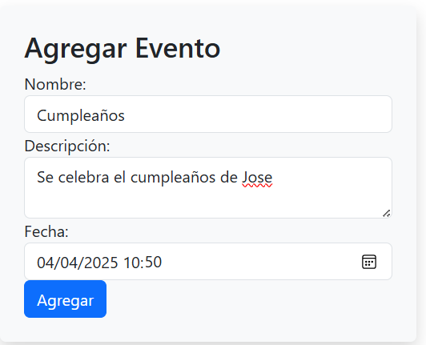
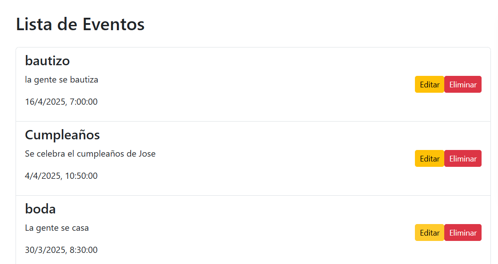
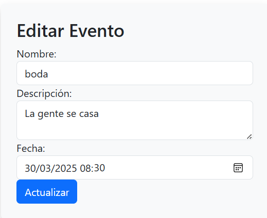

# Proyecto Eventos

{ width="30%" align=left }

!!! tip "Descripción General"
    El proyecto **Eventos** es un ejemplo práctico de cómo crear un API REST utilizando Python y FastAPI. Incluye un backend, un frontend y pruebas automatizadas.

---

## Descripción general del funcionamiento del backend y el frontend

El backend está construido con [FastAPI](https://fastapi.tiangolo.com/). Los archivos de implementación se encuentran en la ruta `/app/proyectos/imayo`. Ahí se definen varias operaciones principales:

- Listar eventos
- Crear evento
- Obtener evento por ID
- Eliminar evento

El frontend está construido con la ayuda de la librería [Textual](https://textual.textualize.io/) para construir la interfaz gráfica de usuario y [httpx](https://www.python-httpx.org/quickstart/) para comunicarse con la base de datos. El frontend se conecta al backend mediante la URL `http://127.0.0.1:8000/api/v1/imayo/eventos`.

### Carga inicial de datos

Cuando el usuario arranca el programa de frontend, este se conecta al backend para obtener la lista de eventos.

A continuación se muestra un diagrama de secuencia que muestra la comunicación inicial entre el frontend y el backend, justo después de que el usuario accedió al frontend.

```mermaid
sequenceDiagram
    participant Usuario
    participant Frontend
    participant Backend

    Usuario-->>Frontend: Arranca frontend de Eventos
    Note over Usuario, Backend: Carga inicial de datos
    rect rgb(191, 123, 155)
        activate Frontend
            Frontend->>Backend: GET /api/v1/imayo/eventos
            activate Backend
            Backend-->>Frontend: Retorna la lista de eventos
            deactivate Backend
            Note right of Frontend: Actualiza la lista de eventos
            Frontend-->>Usuario: Lista de eventos
        deactivate Frontend
    end
```

### Creación de eventos

Una vez que el usuario arrancó el frontend y los datos iniciales han sido cargados, el usuario puede crear un evento mediante el botón *Agregar Evento*. Cuando el usuario hace clic en el botón, se le muestra el siguiente formulario.



El formulario tiene validaciones básicas para no permitir datos inválidos. Si el usuario introduce datos válidos y presiona el botón *Crear*, el frontend hará la operación de creación de evento con el backend. Si la transacción se acepta, volverá a contactar al backend para descargar la lista de eventos y actualizar la interfaz con la nueva información. Ver el siguiente diagrama de secuencia.

```mermaid
sequenceDiagram
    participant Usuario
    participant Frontend
    participant Backend

    Note over Usuario, Backend: Proceso de creación de evento
    rect rgb(91, 23, 155)
    Usuario->>Frontend: Crea un evento
    Frontend->>Backend: POST /api/v1/imayo/eventos
    Backend-->>Frontend: Evento creado exitosamente
    Frontend->>Backend: GET /api/v1/imayo/eventos
    Backend-->>Frontend: Retorna la lista de eventos
    Note right of Frontend: Actualiza la lista de eventos
    end
```

Finalmente, la aplicación de frontend de eventos luce así después de crear varios eventos.



### Modificacion de eventos

La siguiente operacion es la modificacion de algun evento por si se llegan a equivocar en alguna fecha u horario. Se da click en la pestaña de editar y muestra los datos en el formulario listo para modificar. Una vez modificado se da click en aceptar y se guardan los cambios.



### Eliminación de eventos

La última operación es la eliminación de eventos. El frontend tienen validaciones para asegurar que solo se eliminen eventos existentes. Aquí está el diagrama de secuencia de una operación de eliminación de evento.

```mermaid
sequenceDiagram
    participant Usuario
    participant Frontend
    participant Backend

    Note over Usuario, Backend: Proceso de eliminación de evento
    rect rgb(91, 23, 55)
    Usuario->>Frontend: Elimina un evento
    Frontend->>Backend: DELETE /api/v1/imayo/eventos/{evento_id}
    Backend-->>Frontend: Evento eliminado exitosamente
    Frontend->>Backend: GET /api/v1/imayo/eventos
    Backend-->>Frontend: Retorna la lista de eventos
    Note right of Frontend: Actualiza la lista de eventos
    end
```

---

## Backend - Detalle

El código fuente del backend se encuentra en el módulo `app/proyectos/imayo`. Está desarrollado utilizando FastAPI y expone varias rutas:

- **`GET /eventos`**: Obtiene la lista de eventos.
- **`POST /eventos`**: Crea un nuevo evento.
- **`GET /eventos/{evento_id}`**: Obtiene un evento por su ID.
- **`DELETE /eventos/{evento_id}`**: Elimina un evento por su ID.

A continuación se muestran los links a la documentación de cada submódulo.

[Documentación de rutas](){ .md-button .md-button--primary}
[Documentación de modelos](){ .md-button .md-button--primary}
[Documentación de esquemas](){ .md-button .md-button--primary}

### Cómo arrancar el backend

Para iniciar el backend, utiliza el siguiente comando:

```bash
uv run fastapi run
```

---

## Pruebas del Backend

Las pruebas automatizadas del backend se encuentran en el directorio `/tests/test_imayo`. Estas pruebas verifican el correcto funcionamiento de las rutas y la lógica de negocio.

[Documentación de funciones de prueba](tests.md){ .md-button .md-button--primary}

### Cómo ejecutar las pruebas

Para ejecutar las pruebas, utiliza el siguiente comando:

```bash
uv run pytest
```

---

## Frontend

El código fuente del frontend se encuentra en el archivo `/frontend/imayo`. Este módulo interactúa con el backend para mostrar la lista de eventos y permitir operaciones como la creación y eliminación de eventos.

[Documentación de Funciones del frontend](){ .md-button .md-button--primary}

### Cómo arrancar el frontend

Primero arranca el backend, luego abre otra terminal y utiliza el siguiente comando:

```bash
npm start
```