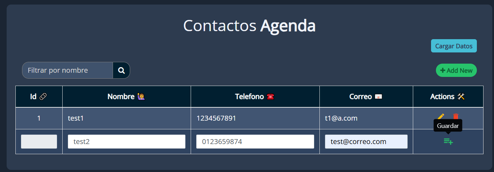
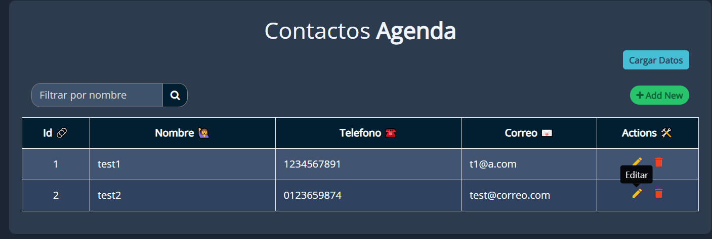
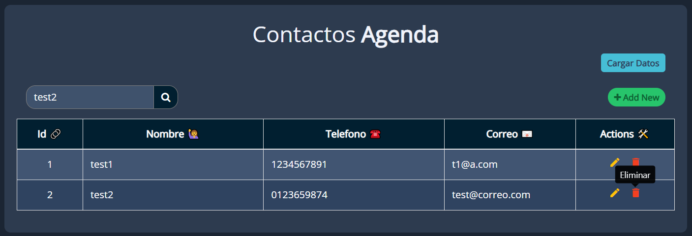

# Agenda de contactos

!!! tip "Descripción General"
    El proyecto **Agenda de Contactos** es un sistema que permite gestionar contactos personales mediante una API REST desarrollada con Python y FastAPI. Incluye un backend para la gestión de contactos y un frontend en HTML para interactuar con el sistema.

---

## Descripción general del funcionamiento del backend y el frontend

El backend está construido con [FastAPI](https://fastapi.tiangolo.com/). Los archivos de implementación se encuentran en la ruta `/app/proyectos/rpalma`. Este backend permite realizar las siguientes operaciones principales:

- Crear un nuevo contacto
- Consultar la lista de contactos
- Actualizar la información de un contacto
- Eliminar un contacto

El frontend es una página HTML que utiliza [jQuery](https://jquery.com/) para comunicarse con el backend mediante solicitudes AJAX. La página se conecta al backend mediante la URL `http://127.0.0.1:8000/api/v1/rpalma/contactos`.


---

### Flujo de cargar los datos

El usuario puede cargar la lista completa de contactos desde el backend. El siguiente diagrama de secuencia muestra este flujo:

```mermaid
    sequenceDiagram
        participant Usuario
        participant Frontend
        participant Backend

        Usuario->>Frontend: Solicita cargar los datos
        Frontend->>Backend: GET /api/v1/rpalma/contactos/agenda
        Backend-->>Frontend: Respuesta con la lista de contactos
        Frontend-->>Usuario: Muestra la lista de contactos en la tabla
```


---

### Flujo de creación de contactos

Cuando el usuario accede a la página HTML, puede crear un nuevo contacto llenando un formulario. El siguiente diagrama de secuencia muestra el flujo de creación de un contacto:

```mermaid
sequenceDiagram
    participant Usuario
    participant Frontend
    participant Backend

    Usuario->>Frontend: Llena el formulario y envía
    Frontend->>Backend: POST /api/v1/rpalma/contactos/create
    Backend-->>Frontend: Respuesta exitosa (contacto creado)
    Frontend-->>Usuario: Actualiza la lista de contactos
```


---

### Flujo de edicion de contactos

El usuario puede actualizar la información de un contacto existente. El siguiente diagrama de secuencia muestra este flujo:

```mermaid
sequenceDiagram
    participant Usuario
    participant Frontend
    participant Backend

    Usuario->>Frontend: Edita la información de un contacto
    Frontend->>Backend: PUT /api/v1/rpalma/contactos/edit/{id}
    Backend-->>Frontend: Respuesta exitosa (contacto actualizado)
    Frontend-->>Usuario: Actualiza la lista de contactos
```


---

### Flujo de buscar contacto por nombre

El usuario puede buscar un contacto específico por su nombre. El siguiente diagrama de secuencia muestra este flujo:

```mermaid
    sequenceDiagram
    participant Usuario
    participant Frontend
    participant Backend

    Usuario->>Frontend: Ingresa el nombre en el buscador
    Frontend->>Backend: GET /api/v1/rpalma/contactos/search/{nombre}
    Backend-->>Frontend: Respuesta con los contactos que coinciden
    Frontend-->>Usuario: Muestra los resultados en la tabla
```


### Flujo de eliminación de contactos

El usuario también puede eliminar un contacto. El siguiente diagrama de secuencia muestra este flujo:

```mermaid
sequenceDiagram
    participant Usuario
    participant Frontend
    participant Backend

    Usuario->>Frontend: Solicita eliminar un contacto
    Frontend->>Backend: DELETE /api/v1/rpalma/contactos/delete/{id}
    Backend-->>Frontend: Respuesta exitosa (contacto eliminado)
    Frontend-->>Usuario: Actualiza la lista de contactos
```



---

## Backend - Detalle

El código fuente del backend se encuentra en el módulo `app/proyectos/rpalma`. Está desarrollado utilizando FastAPI y expone las siguientes rutas:

- **`GET /agenda`**: Obtiene la lista de contactos. [Link a la función](backend.md#app.proyectos.rpalma.routes.agenda_list)
- **`POST /create`**: Crea un nuevo contacto. [Link a la función](backend.md#app.proyectos.rpalma.routes.crear_contacto)
- **`PUT /edit/{id}`**: Actualiza la información de un contacto. [Link a la función](backend.md#app.proyectos.rpalma.routes.editar_contacto)
- **`DELETE /delete/{id}`**: Elimina un contacto. [Link a la función](backend.md#app.proyectos.rpalma.routes.eliminar_contacto)
- **`SEARCH /search/{nombre0`**: Busca un contacto en la agenda. [Link a la función](backend.md#app.proyectos.rpalma.routes.buscar_contacto)


[Documentación de rutas](backend/#routes){ .md-button .md-button--primary}
[Documentación de modelos](backend/#models){ .md-button .md-button--primary}
[Documentación de esquemas](backend/#schemas){ .md-button .md-button--primary}

---

## Pruebas del Backend

Las pruebas automatizadas del backend se encuentran en el directorio `/tests/rpalma`. Estas pruebas verifican el correcto funcionamiento de las rutas y la lógica de negocio.

[Documentación de funciones de backend](backend.md){ .md-button .md-button--primary}

### Cómo ejecutar las pruebas

Para ejecutar las pruebas, utiliza el siguiente comando:

```bash
uv run pytest
```

[Documentación de funciones de Pytest](tests.md){ .md-button .md-button--primary}


## Frontend

El frontend es una página HTML que permite al usuario interactuar con el backend para gestionar contactos. El código fuente se encuentra en el archivo `/frontend/rpalma.html`.

!!! note "Advertencia"
    Para poder iniciar a hacer uso de todas las funciones de la API de contactos, se deben cargar los datos por lo menos una vez para que se habiliten el campo de "Filtrar por nombre" y el boton de "Add new". Una vez cargados los datos, se podran agregar otros contactos, editar contactos existentes o eliminarlos.

[Documentación de frontend](frontend.md){ .md-button .md-button--primary}

### Cómo arrancar el frontend

- Primero arranca el backend:
``` bash
uv run fastapi dev
```

- Despues ejecuta el servidor http 
``` bash
    cd c:/[ubicacion/del/html] 
    python -m http.server 3000 --bind 127.0.0.1
```

- Abrir cualquier navegador web e ir a: `http://127.0.0.1:3000/contactos.html`. 